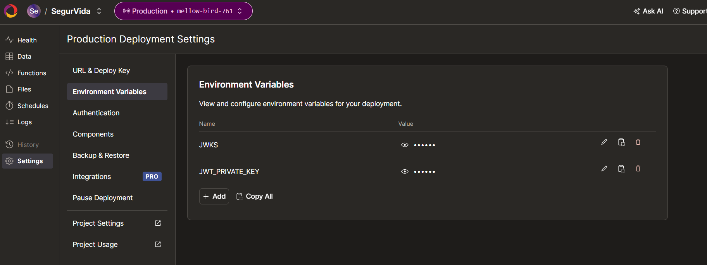

# Guía de Instalación y Configuración

Este documento explica paso a paso cómo instalar las dependencias, configurar **Convex**, **Expo**, y **Firebase**, y levantar la aplicación del proyecto **SegurVida**.

---

## 1. Instalación de Node y PNPM

1. Instalar **nvm**:  
   ```bash
   curl -o- https://raw.githubusercontent.com/nvm-sh/nvm/v0.40.3/install.sh | bash
   ```
   **Nota** esto es para instalar node, si ya lo tienen usen el que tienen o buscar algun tutorial.
2. Verificar instalación:  
   ```bash
   nvm --version
   ```
3. Instalar Node LTS:  
   ```bash
   nvm install --lts
   ```
4. Verificar instalación de Node:  
   ```bash
   node --version
   ```
5. Instalar **pnpm** (IMPORTANTE: no usar `npm`, ya que puede corromper `pnpm-lock.yaml`):  
   ```bash
   npm install -g pnpm
   ```
6. Verificar instalación de pnpm:  
   ```bash
   pnpm --version
   ```
7. Instalar dependencias del proyecto (en el root del repositorio):  
   ```bash
   pnpm install
   ```

---

## 2. Configuración de Convex

1. Crear una cuenta en [Convex](https://www.convex.dev/).
2. Enviar la direccion de correo (con la que creaste la cuenta) a Flor para recibir la invitación al **team SegurVida**.
3. Aceptar la invitación y confirmar que puedes ver el proyecto **SegurVida** en Convex.
4. Levantar Convex:  
   ```bash
   pnpm convex dev
   ```
   Durante la primera ejecución:
   - `Login or create and account.` 
   - `Device name` --> Aceptar la opcion por defecto o escribir una
   - `Open the browser?` --> Y
   - Completar el login.
   - `Choose an existing project`
   - Seleccionan el Team `SegurVida`
   - `Configure project SegurVida?` --> Y
   - Si todo salió bien, deberías ver:  
     ```
     Convex functions ready! (X.XXs)
     ```
5. **Nota:** Convex debe estar siempre corriendo con:  
   ```bash
   pnpm convex dev
   ```
   Esto permite que la app en development se conecte a la base de datos.

---
## 3. Variables de entorno

1. En Convex, ir al entorno `Production`.
2. Copiar las variables de entorno (`Copy All`).
3. Cambiar al entorno `Development` y pegarlas allí. 
   
   Le dan a `Copy All`, cambian a su `Development` en convex de vuelta, y pegan esas dos variables. 

---

## 4. Levantar la aplicación con Expo

1. Instalar **npx** si no lo tienes:  
   ```bash
   npm install -g npx
   ```
2. Ejecutar la app:  
   ```bash
   npx expo start
   ```
   Si todo sale bien deberías ver:  
   ```
   Logs for your project will appear below. Press Ctrl+C to exit.
   ```
3. Terminar la ejecucion, ya que la tendremos que comenzar de nuevo mas adelante.
---

## 5. Configuración de Firebase (Notificaciones Push)

1. Ingresar a [Firebase Console](https://console.firebase.google.com/).
2. Crear una cuenta y enviar tu direccion de correo (con la que te creaste la cuenta) a Flor para recibir acceso al proyecto **SegurVida**.
3. Aceptar la invitación en tu correo.

---

## 6. Configuración de Expo y EAS

1. Crear una cuenta en [Expo](https://expo.dev/).
2. Enviar tu correo al administrador para recibir acceso al proyecto.
3. Instalar **eas-cli**:  
   ```bash
   npm install --global eas-cli
   ```
4. Inicializar con el ID del proyecto:  
   ```bash
   eas init --id ecaafaf3-d301-4c24-a078-d2ed8c7807f3
   ```

---

## 7. Realizar un Build de Prueba

1. Asegurarse de estar en la rama `main` y con los últimos cambios.
2. Ejecutar:  
   ```bash
   eas build --profile development
   ```
3. Seleccionar la plataforma (**Android**).
4. Generar un nuevo Android Keystore (`Y`).
5. Revisar el link de logs que aparecerá en consola.
6. Al finalizar, se mostrará un **código QR** para instalar la app en tu celular.
   - Cuando pregunte `Install and run the Android build on an emulator?`, responder `n` (el sistema de notificaciones no funciona en emulador).
7. Una vez instalada la app en el celular:
   - Ejecutar en tu PC:  
     ```bash
     npx expo start
     ```
   - En el celular, seleccionar el servidor o con la camara del telefono, escanear el QR de la terminal, te va a abrir la app que descargaste automaticamente y empezar el build local.
8. Crear una cuenta dentro de la app y comenzar a usarla.  
   **Nota:** recuerda tener corriendo `pnpm convex dev`.

---
